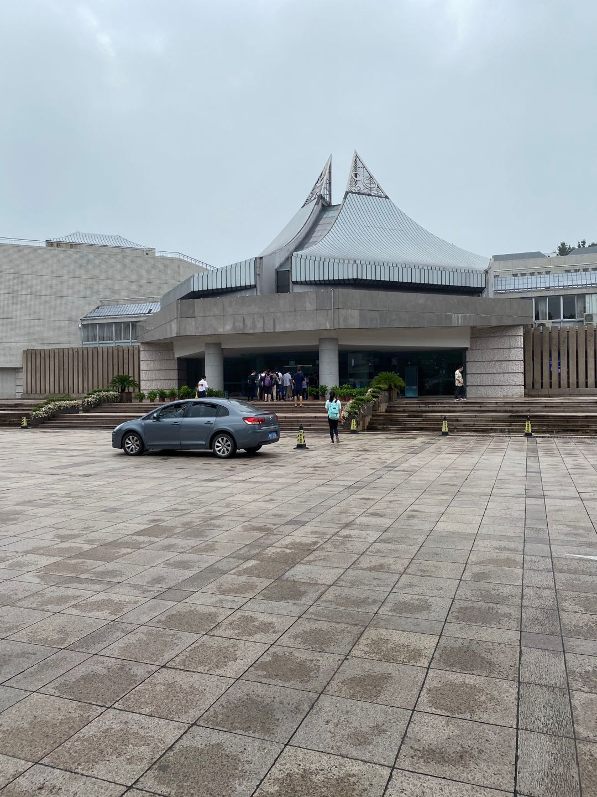

### 前言  
今天去了浙江图书馆，太远了，坐公交车要1个多小时，看来以后还是去杭州图书馆吧！今天心情依旧不好，9点到了图书馆，意想不到的是这边似乎排队并不长，但是进来之后发现位子几乎都被占满了，难道这边会提前开馆吗！如图：

浙江图书馆的环境不是很好，座位坐的不舒服，而且房屋矮小，完全没有杭州图书馆那种高大上的逼格。

### 今天干些什么呢  
* 函数组合与函数柯里化  
* koa-compose源码阅读与学习    