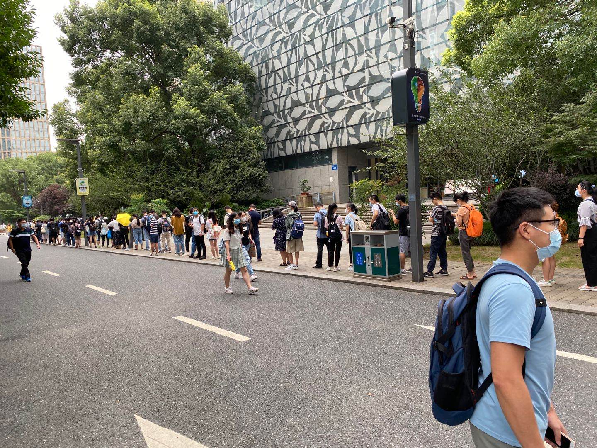

### 前言  
今天9点到了杭州图书馆，依旧排起了长队,感受一下。

有点失落，恒生的面试居然挂了，算了，继续面试吧！！！简历上写了看过框架源码，心里有点虚，虽然自己blog更新了2年多，但是关于源码阅读的方面还是没有，都是偏应用类的和算法leetcode这些。现在也在开始恶补框架原理，希望还来得及。对了，我准备开始做外文翻译，这项工作很有意义。昨天刚翻译了一篇关于redux的文章，感觉非常好。

### 今日输出  
- 淘宝笔试题  
- redux学习  
