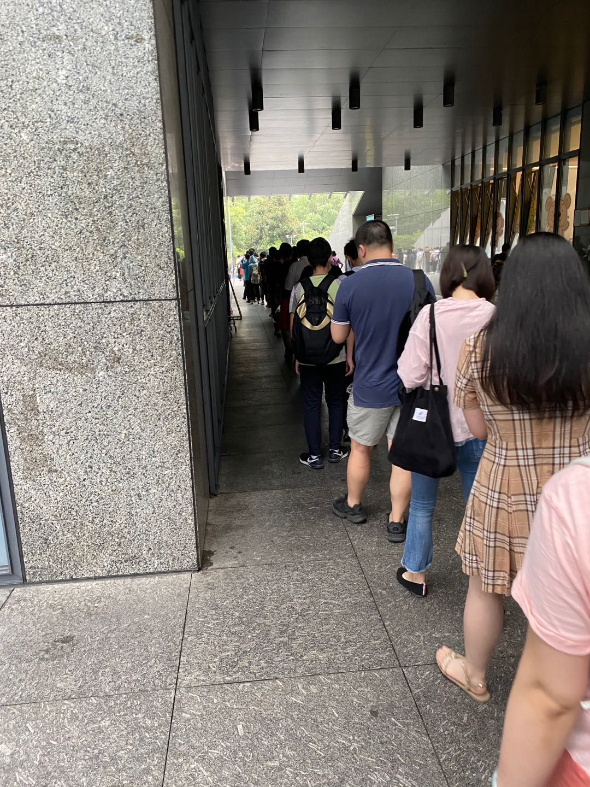

### 前言  
昨天晚上比较郁闷，佰钧成外包这边的hr说要继续工作下去的话只能将工资提到14k，只有14k也太少了。做了外包感觉就摆脱不了他们了，9点钟就睡了。今天很早就醒了，5点多醒了然后又睡到了7点多，出发到了杭州图书馆，这是今日9点杭州图书馆长队。

### 今日输出  
- 循环动画的几种实现方式总结对比：requestAnimationFrame、setTimeout/setInterval、css的keyframes。